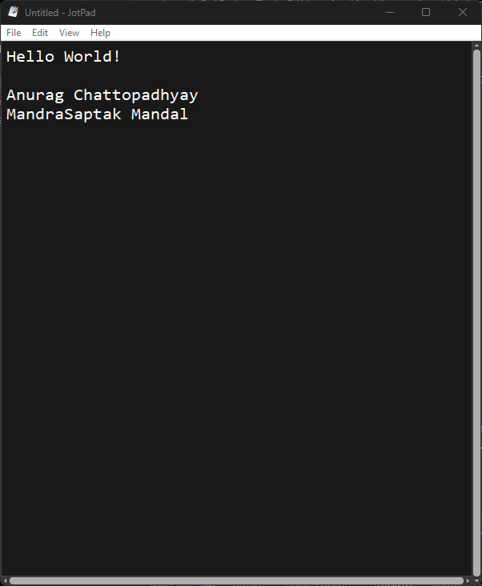
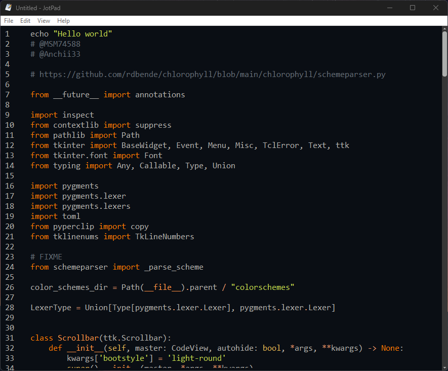

# JotPad
[](https://www.python.org/)
[](https://docs.python.org/3/library/tkinter.html)

## 📷 Screenshots




## ⚡️ Quick start

Install dependencies:

```python
pip3 install -r requirements.txt
```

```bash
make .
```

## Notes

- Create venv"

    ```bash
    # Create virtual env named venv
    # python3 for linux

    python -m venv venv

    # activate virutual env named venv
    # WINDOWS
    venv\Scripts\activate
    # Linux
    source venv/bin/activate
    ```

- Auto create requirements.txt

    ```bash
    # using pipreqs pkg
    # pipreqs /path/to/your/project
    pipreqs .

    # install dependencies (pip3 for linux)
    pip install -r requirements.txt
    ```

## 🗒️ ToDo

- Add make file
- Add requirements.txt
- Add pyinstaller config file
- Add .python-version
- Use Chlorophyll for syntax highlighting

## Ideas

- common patters to add, TODO, DEBUG, REDO, FIXME, ERROR. These will be get highlighted
- https://stackoverflow.com/questions/38594978/tkinter-syntax-highlighting-for-text-widget
- https://stackoverflow.com/a/77662152